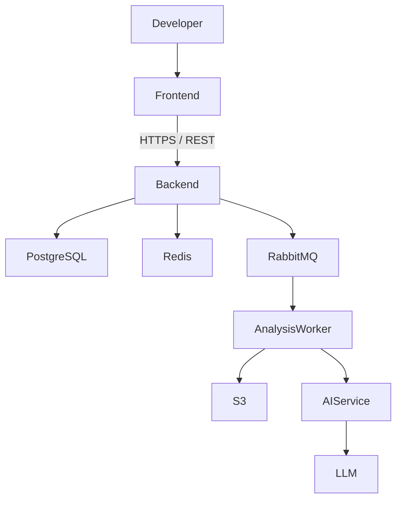

# DevLens Architecture

## 1. Architecture Goals

The DevLens architecture is designed around the following goals:

### Maintainability

The system should be easy to understand, test, modify, and extend without introducing unnecessary complexity.

### Scalability

The architecture should support the growth of users, repositories, and analysis workloads without requiring major architectural changes.

### Security

User data, source code, credentials, and application secrets must be protected throughout the system.

### Extensibility

The system should allow new analysis capabilities, AI models, and external integrations to be added with minimal impact on existing components.

### Developer Experience

The project should provide a consistent and reproducible development environment, with clear documentation, automated testing, and development tooling.

## 2. High-Level Architecture

DevLens follows a modular architecture composed of a frontend application, a backend API, persistent storage, asynchronous processing, and an AI analysis layer.

The main components are:

- **Frontend** – Provides the user interface and communicates with the backend through HTTPS/REST APIs.
- **Backend API** – Handles authentication, business logic, repository management, analysis orchestration, and communication with external services.
- **PostgreSQL** – Stores persistent application data.
- **Redis** – Provides caching and temporary high-speed data storage.
- **RabbitMQ** – Handles asynchronous communication between the backend and analysis workers.
- **Analysis Worker** – Performs repository processing and analysis tasks in the background.
- **AI Service** – Provides an abstraction layer between the application and AI model providers.
- **AWS S3** – Stores repository artifacts, reports, and other large files.
- **LLM** – Processes relevant analysis data and generates insights and recommendations.



## 3. Frontend

The DevLens frontend will be built using React and TypeScript.

Vite will be used as the frontend build tool and development server, while Tailwind CSS will be used for styling.

The frontend will communicate with the backend through HTTPS/REST APIs. It will not communicate directly with the database, message broker, or other backend infrastructure components.

The frontend will follow a feature-oriented structure to keep related functionality organized and maintainable.

The initial structure will be organized as follows:

```text
frontend/
└── src/
    ├── components/
    ├── features/
    ├── pages/
    ├── hooks/
    ├── services/
    ├── api/
    ├── types/
    ├── utils/
    └── assets/
```
## 4. Backend

The DevLens backend will be built using Java 21 and Spring Boot.

The backend will follow a package-by-feature architecture. Instead of organizing the application primarily by technical layers, related functionality will be grouped into feature-based modules.

The initial backend structure will be organized around the following modules:

```text
backend/
└── src/main/java/com/devlens/
    ├── auth/
    ├── user/
    ├── repository/
    ├── analysis/
    ├── ai/
    └── shared/
```

## 5. Data Storage

DevLens will use different storage technologies based on the type and lifetime of the data being stored.

The main storage components are:

- **PostgreSQL** – Primary persistent data store.
- **Redis** – Cache and temporary high-speed data storage.
- **AWS S3** – Object storage for repository artifacts, reports, and other large files.

### PostgreSQL

PostgreSQL will be the primary source of truth for persistent application data.

The database will store entities such as:

- Users
- Repositories
- Analyses
- Findings
- Recommendations

PostgreSQL will be responsible for maintaining the consistency and durability of application data.

### Redis

Redis will be used for data that benefits from fast access and does not need to be the primary source of truth.

Potential use cases include:

- Caching frequently accessed data
- Rate limiting
- Temporary application state

Redis data should not be treated as the authoritative source for persistent application data.

### AWS S3

AWS S3 will be used for object storage.

Potential use cases include:

- Repository snapshots
- Analysis artifacts
- Generated reports
- Other large files

Large binary or file-based data should not be stored directly in PostgreSQL when object storage is more appropriate.

## 6. Asynchronous Processing

Repository analysis can be a long-running operation and should not block synchronous API requests.

DevLens will use asynchronous processing to decouple the API layer from resource-intensive analysis tasks.

RabbitMQ will be used as the message broker between the backend API and analysis workers.

The general flow is:

```text
Frontend
    |
    | Start analysis
    v
Backend API
    |
    | Publish analysis job
    v
RabbitMQ
    |
    | Consume job
    v
Analysis Worker
    |
    +--> Repository Processing
    +--> Static Analysis
    +--> AI Analysis
    |
    v
Analysis Results
```

## 7. AI Architecture

AI capabilities are a core component of DevLens and will be designed to remain independent from the rest of the application.

The initial implementation will use an external LLM provider through an internal AI Service abstraction. This approach allows the application to start with an existing model while keeping the architecture flexible enough to support different providers and deployment strategies in the future.

The general flow is:

```text
Analysis Worker
      |
      v
  AI Service
      |
      v
  LLM Provider
      |
      v
AI-generated Insights
```

## 8. Cloud Infrastructure

DevLens will be designed to support both local development and cloud deployment.

The local development environment will use Docker Compose to provide the infrastructure dependencies required by the application.

The initial local infrastructure will include:

- PostgreSQL
- Redis
- RabbitMQ

PostgreSQL will initially run locally during development. As the project becomes more mature, the database can be hosted using Supabase's managed PostgreSQL infrastructure.

### AWS

AWS will be introduced as the primary cloud platform for application infrastructure and deployment.

The initial AWS services planned for DevLens are:

- **Amazon ECS** – Containerized deployment of the backend and analysis workers.
- **Amazon S3** – Object storage for repository artifacts, analysis reports, and other large files.
- **Amazon CloudWatch** – Application logging, monitoring, and metrics.

The cloud architecture will be introduced incrementally rather than from the beginning of development.

The application should first become functional and reproducible locally before being deployed to AWS.

### Containerization

Docker will be used to create reproducible application environments.

The main application components will be packaged as containers where appropriate.

This allows the same application artifacts to be used across local development, testing, and cloud deployment.

### Environment Separation

The application will support separate configurations for different environments, such as:

- Development
- Testing
- Production

Environment-specific configuration and secrets will not be hardcoded into the source code.

## 9. CI/CD

DevLens will use GitHub Actions as the initial CI/CD platform.

The CI/CD pipeline will automate building, testing, code quality checks, and eventually application deployment.

### Continuous Integration

Every pull request and relevant push should trigger the CI pipeline.

The initial CI pipeline will perform the following steps:

```text
Push / Pull Request
        |
        v
GitHub Actions
        |
        +--> Build
        |
        +--> Unit Tests
        |
        +--> Code Quality Checks
        |
        +--> Integration Tests
        |
        v
Pipeline Result
```
## 10. Future Evolution

The DevLens architecture is designed to evolve as the project grows and new requirements emerge.

Potential future improvements include:

- Scaling analysis workers horizontally
- Supporting multiple AI model providers
- Introducing Retrieval-Augmented Generation (RAG)
- Supporting local and specialized AI models
- Introducing fine-tuned models when sufficient domain-specific data is available
- Moving additional infrastructure components to managed cloud services
- Introducing more advanced observability and monitoring
- Improving automated testing and deployment pipelines
- Extracting individual modules into independent services if the system's scale justifies it

The architecture should evolve based on measurable requirements rather than introducing additional technologies without a clear purpose.
